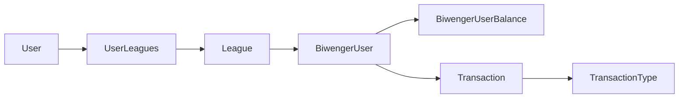

# 🏆 BiwAPI

<div align="center">


Una aplicación web completa para el análisis y gestión de ligas de Biwenger con integración API completa.

[✨ Características](#-características) • [📥 Instalación](#-instalación) • [⚙️ Configuración](#️-configuración) • [🌐 API](#-api-endpoints) • [🤝 Contribuir](#-contribuir)

</div>

---

## 📝 Descripción

**BiwAPI** es una aplicación web desarrollada en Laravel que permite gestionar y analizar ligas de fútbol fantasy de Biwenger. La aplicación integra directamente con la API oficial de Biwenger para obtener datos en tiempo real sobre usuarios, transacciones, fichajes y estadísticas de ligas.

### 🎯 Propósito

- **Análisis avanzado** de transacciones y movimientos de mercado
- **Gestión centralizada** de múltiples ligas
- **Seguimiento histórico** de balances y estadísticas de usuarios
- **Dashboard interactivo** con métricas en tiempo real
- **Sistema de usuarios** con roles y permisos

---

## ✨ Características

### 🏅 Gestión de Ligas
- **Múltiples ligas**: Soporte para gestionar varias ligas simultáneamente
- **Sincronización automática**: Actualización automática desde la API de Biwenger
- **Datos en tiempo real**: Standings, puntos y estadísticas actualizadas
- **Historial completo**: Seguimiento de toda la actividad de la liga

### 💰 Análisis de Transacciones
- **Fichajes del mercado**: Compras y ventas desde el mercado oficial
- **Transferencias entre usuarios**: Intercambios directos entre usuarios

### 👥 Gestión de Usuarios
- **Perfiles detallados**: Información completa de cada usuario
- **Balances históricos**: Seguimiento diario de saldos y valores de equipo
- **Estadísticas personalizadas**: Métricas individuales de rendimiento
- **Sistema de roles**: Administradores y usuarios estándar

---

## 🛠️ Tecnologías

| Tecnología | Versión | Propósito |
|------------|---------|-----------|
| **Laravel** | 10.x | Framework backend principal |
| **PHP** | 8.1+ | Lenguaje de programación |
| **MySQL** | 8.0+ | Base de datos principal |
| **Bootstrap** | 5.2 | Framework CSS |
| **Vite** | 5.0 | Build tool y asset bundling |
| **Guzzle HTTP** | 7.2 | Cliente HTTP para API calls |
| **Laravel Sanctum** | 3.3 | Autenticación API |

---

## 📥 Instalación

### Prerrequisitos

- PHP 8.1 o superior
- Composer
- Node.js & NPM
- MySQL 8.0+
- Servidor web (Apache/Nginx)

### 🚀 Instalación Rápida

```bash
# 1. Clonar el repositorio
git clone https://github.com/angelmohi/biw-api.git
cd biw-api

# 2. Instalar dependencias de PHP
composer install

# 3. Instalar dependencias de Node.js
npm install

# 4. Copiar archivo de configuración
cp .env.example .env

# 5. Generar clave de aplicación
php artisan key:generate

# 6. Configurar base de datos en .env
# DB_CONNECTION=mysql
# DB_HOST=127.0.0.1
# DB_PORT=3306
# DB_DATABASE=biw_api
# DB_USERNAME=root
# DB_PASSWORD=

# 7. Ejecutar migraciones
php artisan migrate

# 8. Compilar assets
npm run build

# 9. Iniciar servidor de desarrollo
php artisan serve
```

### 🐳 Docker (Opcional)

```bash
# Usando Laravel Sail
./vendor/bin/sail up -d
./vendor/bin/sail artisan migrate
```

---

## ⚙️ Configuración

### 🔑 Variables de Entorno

Configura las siguientes variables en tu archivo `.env`:

```env
# Configuración de la aplicación
APP_NAME="BiwAPI"
APP_ENV=local
APP_DEBUG=true
APP_URL=http://localhost

# Base de datos
DB_CONNECTION=mysql
DB_HOST=127.0.0.1
DB_PORT=3306
DB_DATABASE=biw_api
DB_USERNAME=root
DB_PASSWORD=

# Configuración de BiwAPI
BIWENGER_BASE_URL=https://biwenger.as.com/api/v2
BIWENGER_TIMEOUT=30
BIWENGER_RETRY_TIMES=3
BIWENGER_RETRY_SLEEP=1000
BIWENGER_RATE_LIMIT=60
BIWENGER_RATE_DECAY=1
BIWENGER_CACHE_TTL=300
BIWENGER_LOG_REQUESTS=false
BIWENGER_LOG_ERRORS=true

# Cache y sesiones
CACHE_DRIVER=file
SESSION_DRIVER=file
QUEUE_CONNECTION=sync
```

### 🎯 Configuración de Ligas

Para añadir una nueva liga, necesitarás los tokens de autenticación de Biwenger:

1. **Bearer Token**: Token de autenticación principal
2. **League ID**: ID numérico de la liga en Biwenger
3. **User ID**: ID del usuario autenticado
4. **League Token**: Token específico de la liga

### 📋 Comandos Artisan

```bash
# Actualizar todas las ligas
php artisan leagues:update

# Actualizar una liga específica
php artisan leagues:update --league=123

# Actualizar con timeout personalizado
php artisan leagues:update --timeout=600

# Forzar actualización
php artisan leagues:update --force
```

---

## 🗄️ Estructura de Base de Datos

### 📊 Principales Tablas

| Tabla | Descripción |
|-------|-------------|
| `league` | Información de ligas |
| `biwenger_user` | Usuarios de Biwenger por liga |
| `biwenger_user_balance` | Histórico de balances diarios |
| `transaction` | Transacciones y fichajes |
| `transaction_type` | Tipos de transacciones |
| `users` | Usuarios del sistema |
| `user_leagues` | Relación usuarios-ligas |

### 🔗 Relaciones Principales



---

## 🌐 API Endpoints

### 🔐 Autenticación

La aplicación utiliza Laravel Sanctum para la autenticación API.

### 📍 Rutas Principales

| Método | Endpoint | Descripción |
|--------|----------|-------------|
| `GET` | `/` | Dashboard principal |
| `GET` | `/leagues` | Lista de ligas |
| `GET` | `/leagues/{id}` | Detalles de liga |
| `GET` | `/leagues/{id}/transactions` | Transacciones de liga |
| `POST` | `/leagues` | Crear nueva liga |
| `PUT` | `/leagues/{id}` | Actualizar liga |

### 🔧 Integración con Biwenger API

La aplicación integra con los siguientes endpoints de Biwenger:

- **League Data**: `/league/{id}?include=all`
- **Players Data**: `/competitions/la-liga/data`
- **Transactions**: `/league/{id}/board`

---

## 🏗️ Arquitectura

### 📁 Estructura del Proyecto

```
app/
├── Clients/           # Clientes HTTP para APIs externas
├── Console/Commands/  # Comandos Artisan personalizados
├── Contracts/         # Interfaces y contratos
├── Helpers/           # Clases auxiliares
├── Http/Controllers/  # Controladores web
├── Models/           # Modelos Eloquent
└── Services/         # Lógica de negocio

config/
├── biwenger.php      # Configuración específica de Biwenger
└── ...

database/
├── migrations/       # Migraciones de base de datos
└── seeders/         # Seeders de datos

resources/
├── views/           # Plantillas Blade
├── css/            # Estilos CSS
└── js/             # JavaScript

routes/
├── web.php         # Rutas web
└── api.php         # Rutas API
```

### 🔄 Flujo de Datos

1. **Sincronización**: El comando `leagues:update` obtiene datos de Biwenger
2. **Procesamiento**: Los servicios procesan y normalizan los datos
3. **Almacenamiento**: Los datos se guardan en la base de datos local
4. **Visualización**: Los controladores exponen los datos a las vistas
5. **Cache**: Se implementa caché para optimizar el rendimiento

---

## 🧪 Testing

```bash
# Ejecutar todas las pruebas
php artisan test

# Ejecutar pruebas con cobertura
php artisan test --coverage

# Ejecutar pruebas específicas
php artisan test --filter=LeagueTest
```

---

## 🚀 Despliegue

### 📦 Producción

```bash
# Optimizar para producción
composer install --optimize-autoloader --no-dev
php artisan config:cache
php artisan route:cache
php artisan view:cache
npm run build
```

### 🔄 Automatización

Configura un cron job para actualizar las ligas automáticamente:

```bash
# Añadir al crontab
* * * * * cd /path/to/biw-api && php artisan schedule:run >> /dev/null 2>&1

# O ejecutar manualmente cada hora
0 * * * * cd /path/to/biw-api && php artisan leagues:update
```

---

## 🤝 Contribuir

¡Las contribuciones son bienvenidas! Por favor:

1. **Fork** el proyecto
2. **Crea** una rama para tu feature (`git checkout -b feature/nueva-funcionalidad`)
3. **Commit** tus cambios (`git commit -am 'Añadir nueva funcionalidad'`)
4. **Push** a la rama (`git push origin feature/nueva-funcionalidad`)
5. **Abre** un Pull Request

### 📝 Guías de Contribución

- Sigue las convenciones de código de Laravel
- Escribe tests para nuevas funcionalidades
- Documenta los cambios en el CHANGELOG
- Mantén la compatibilidad hacia atrás

---

## 👨‍💻 Autor

**angelmohi** - [@angelmohi](https://github.com/angelmohi)

---

## 🆘 Soporte

Si tienes problemas o preguntas:

1. 📋 Revisa los [Issues existentes](https://github.com/angelmohi/biw-api/issues)
2. 🆕 Crea un [nuevo Issue](https://github.com/angelmohi/biw-api/issues/new)

---

## 🙏 Agradecimientos

- **Laravel Framework** - Por proporcionar una base sólida
- **Biwenger** - Por la API que hace posible este proyecto
- **Comunidad Open Source** - Por las librerías y herramientas utilizadas

---

<div align="center">

**⭐ Si este proyecto te ha sido útil, considera darle una estrella ⭐**

Hecho con ❤️ por [angelmohi](https://github.com/angelmohi)

</div>